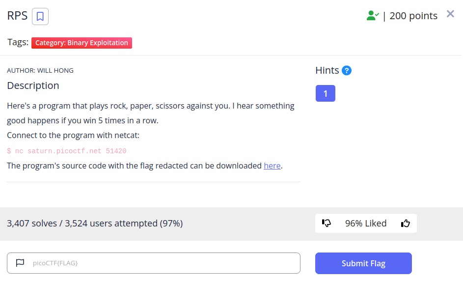
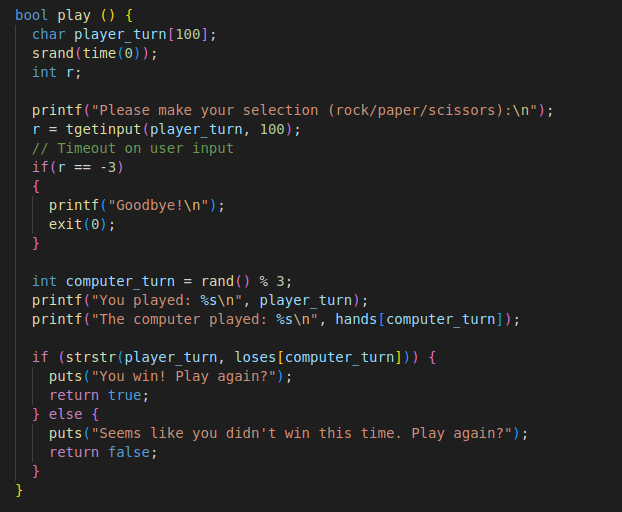
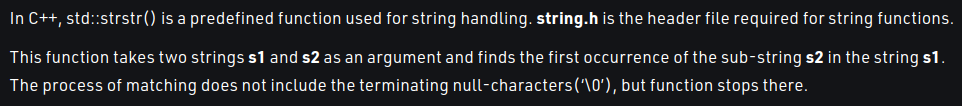
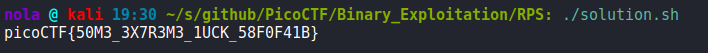

This time, we have to exploit C program in which 5 rock, paper, scissors wins in a row are required to retrieve a flag. We could technically just brute force it until we win 5 times in a row, but that's not the most elegant way to complete this challenge. Instead we can analyze the source code. Here's the play() function:

If we look closely, that function uses strstr() function to verify our input. However, this function is exploitable. Lets look at the definition:

According to geeksforgeeks, strstr() takes two parameters and check whether one of them (random choice from rock/paper/scissors possibilities) is a substring of input we provided. At the same time, nothing is stopping us from providing input that contains all those possibilities making it a match every round and resulting in strstr() returning true, making it a win. There is also very simple shell one liner to solve this challenge for us:

