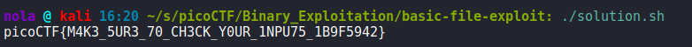

In this challenge, we are provided with C code. Authors made it quite simple for us to find out how to retrieve the flag because 'puts(flag)' line can be found in the code:

For it to be executed, we have to entry number we provided is 0. To make sure that we are asked about entry number in data_read() function, we have to create a least one entry beforehand (otherwise inputs variable will be equal to 0):

Challenge can be solved by using one line of simple shell code:

