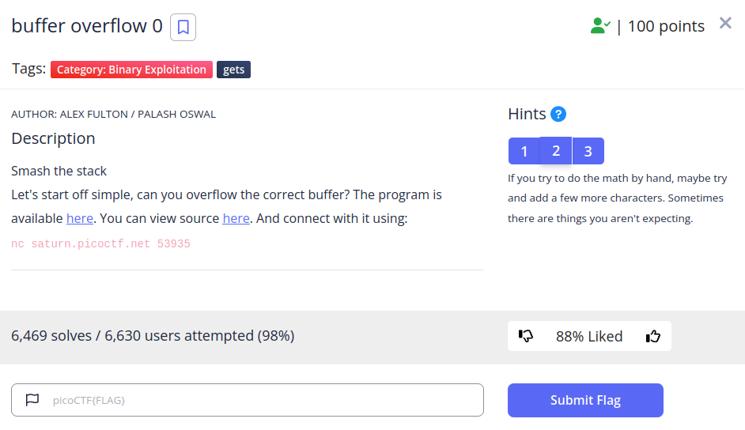
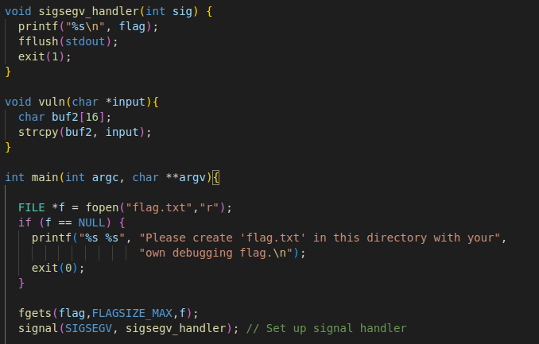
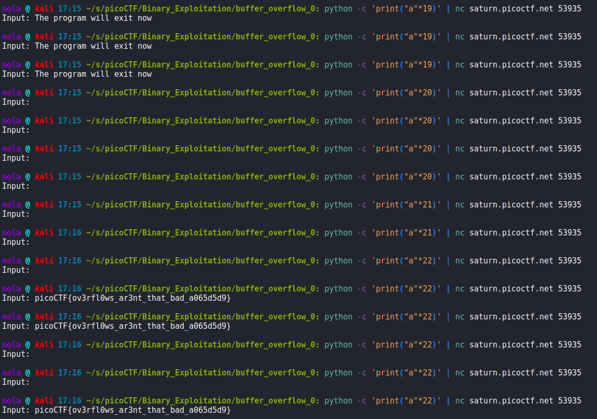
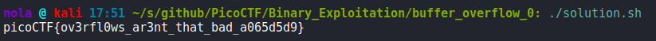

We are provided with C code. Right away we can see that to have flag printed, we need to execute sigsegv_handler() function:

For it to happen, we have to cause Signal Segmentation Violation to ensure that signal() function calls sigsegv_handler(). It occurs when program tries to read or write data outside of memory that has been allocated for it. We can read more about it here:

https://www.tutorialspoint.com/c_standard_library/c_function_signal.htm

If we look closely, buf2 in vuln() function is a 16 byte buffer that we can pass our input to using strcpy() function. That means if we try to provide input of that is at least 17 bytes long, we can cause that Signal Segmentation Violation. However it turned out not to be as straight forward as it seems. Results are somewhat inconsistent and 17 bytes is not enough for Segmentation Violation to occur. To have a chance of retrieving our flag, we need to provide at least 22 bytes long string (22 x 'A' letter for example) and even then we cannot be 100% sure that we get it first try as it still seems to be appearing randomly:

This random behavior is something that I want to look into further and then update this writeup when I feel like I understand the reason. Either way, I created a script that prints long string through netcat as long as flag is not retrieved:

