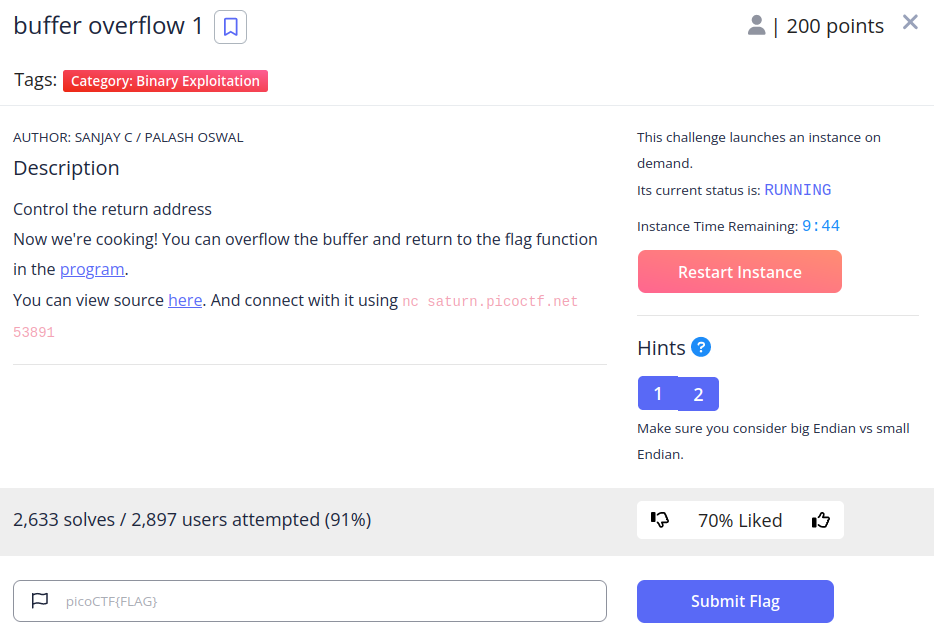
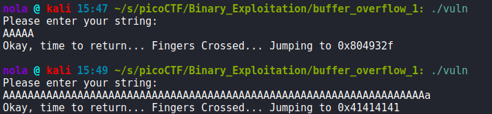
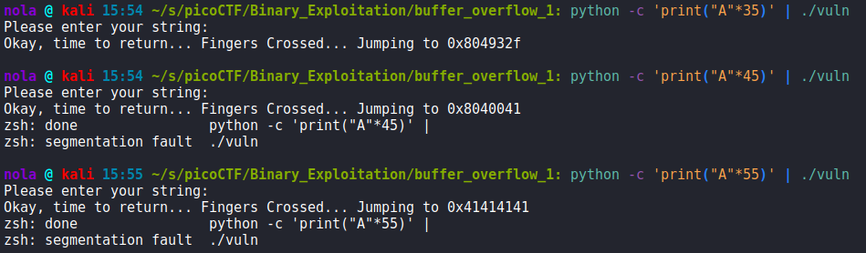
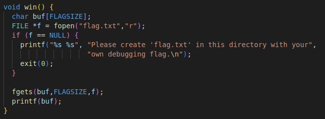
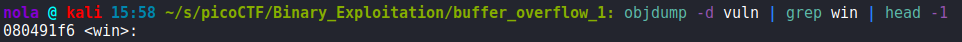
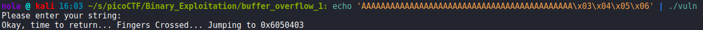
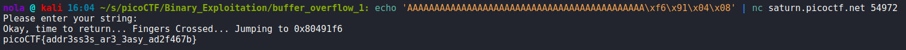
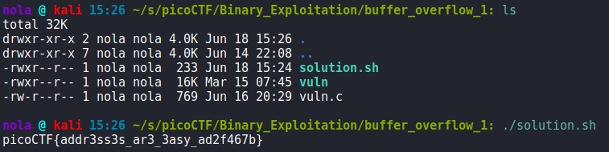

In this challenge, C code has been crafted in such a way that lets us set instruction pointer by exploiting vurnerable gets() fuction. If we pass small amount of characters to the vuln file, we are jumping to 0x804932f address. If we pass a lot of characters to the vuln file, we are jumping to 0x41414141:

By using trail and error method, we can figure out that this behavior is changing at about 45 character. That's where we will try to inject our return address:

But for now, we don't know the return address that we want to inject. What we have to do is to find out what is the address of win() function that is most likely what we have to execute in order to retrieve the flag:

We can quickly figure the address of that function by using 'objdump -d vuln | grep win | head -1' command:

Now, if we pass exactly 44 characters to the function, we can control return address by adding 4 more bytes:

If you look carefully, the order has been changed - instead of 0x03040506, we have 0x06050403 or rather 0x6050403 because the first 0 from 06 has been skipped. That is happening because the endianness is different (x86 is using little endian, and our input is big endian rather). Meaning, we have to pass our address in reverse byte order. Since one byte = two hexadecimal characters, instead of 08 04 91 f6, we have to make it f6 91 04 08. Now we are ready to get our flag:

Decided also to automate the entire process by writing a short shell script that does all of the above for us:

