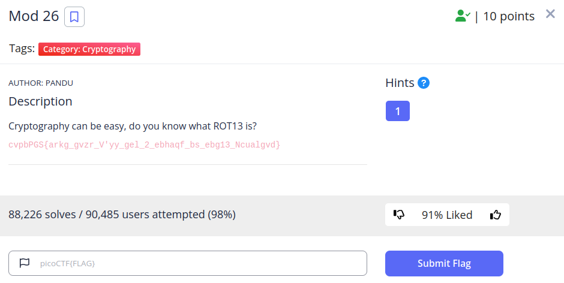
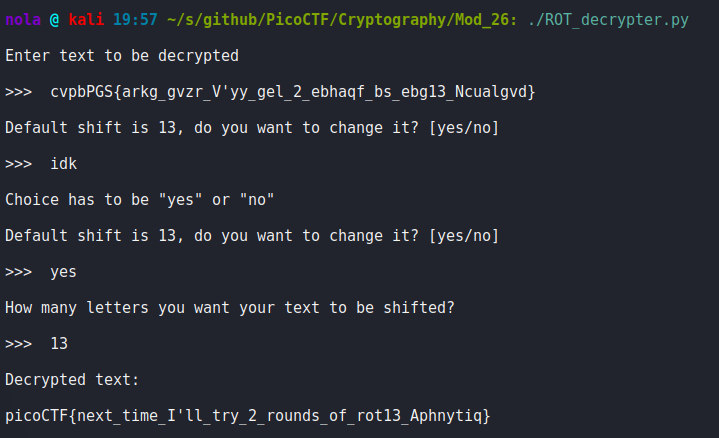

Solving this challenge could be as easy as pasting encrypted string into one of the free online ROT13 decrypters (I particulary enjoy using CyberChef myself) but I decided to have some more fun writing my own ROT decypter that allows string to be shifted by any number. Good enough to solve this challenge but has not been tested thoroughly so as long as you don't go out of your way to break it, I hope it's going to be sufficient ^^

