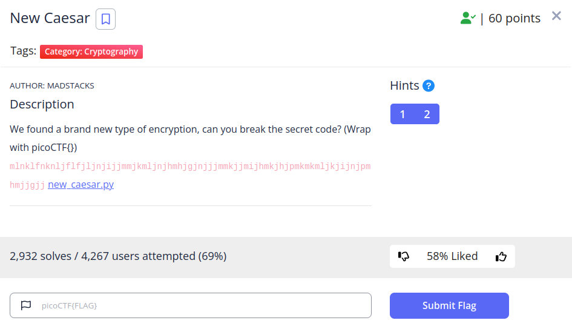
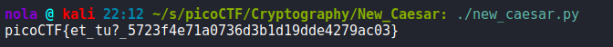

This time, flag has been encoded by taking a number representation of every character, converting it to binary, splitting it in half, assigning a letter from ALPHABET string to both numbers accordingly and then shifting those letters using key. There are two possible ways of solving this challenge that come to my mind. We could either reverse the entire process or we could encode all letters and check what are the matches. I chose the latter. Firstly, if we look carefully, we can find out that there is only 16 possible keys. So I used for loop with every possible key. Then created a dictionary where every key is pre-encoded letter and value are 2 letters that we've gotten due to encoding process. Then, provided string has been taken and compared against those values and when there was a match, result-list was appended with key. Finally, checking whether length of result matches length of encoded string / 2, helped in filtering for result created using the correct key:

