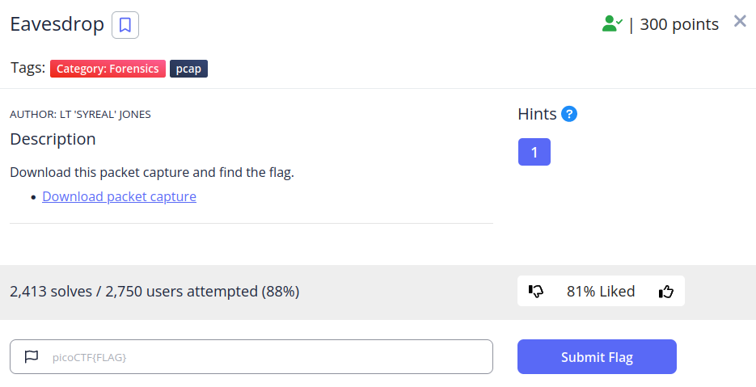
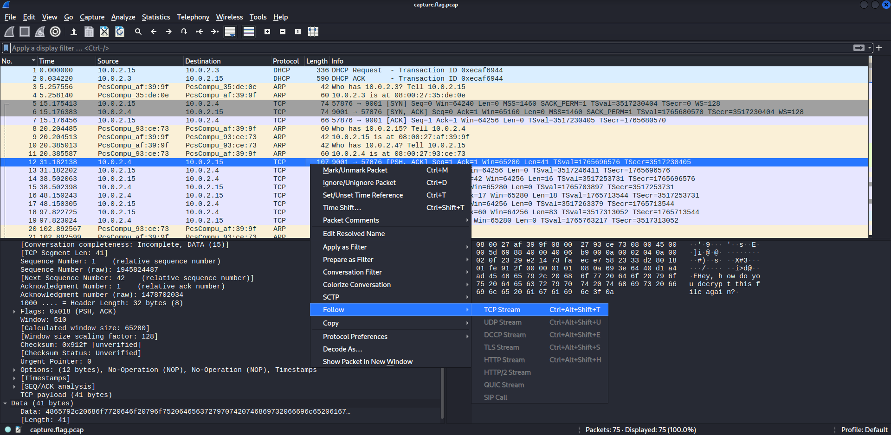
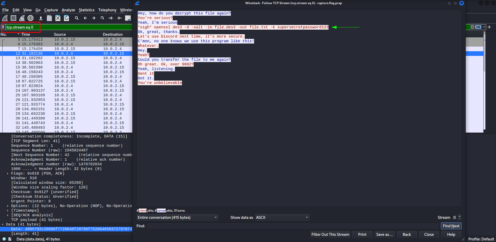
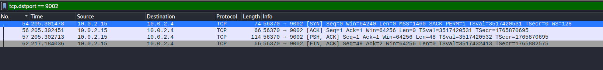
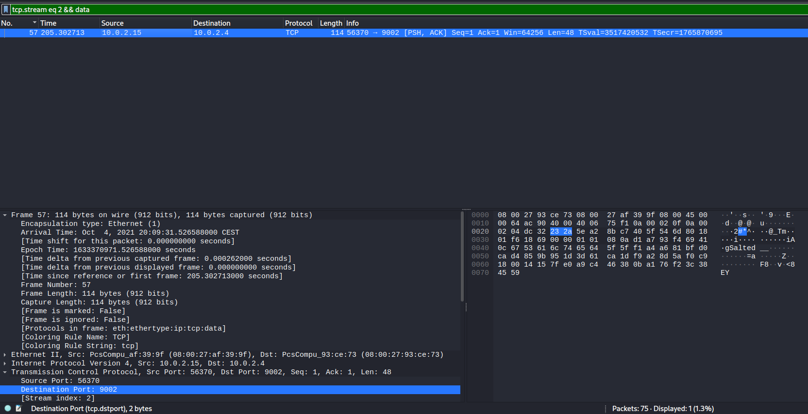
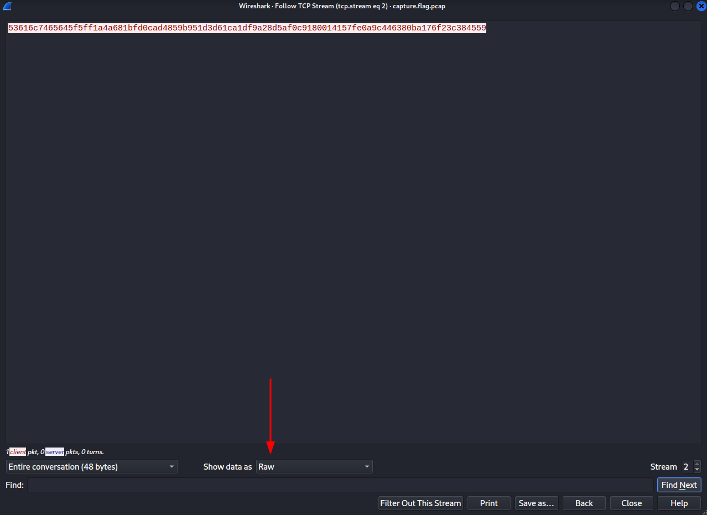
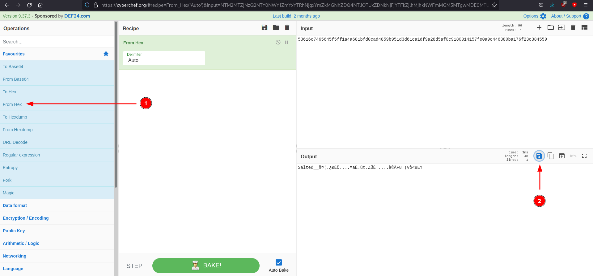
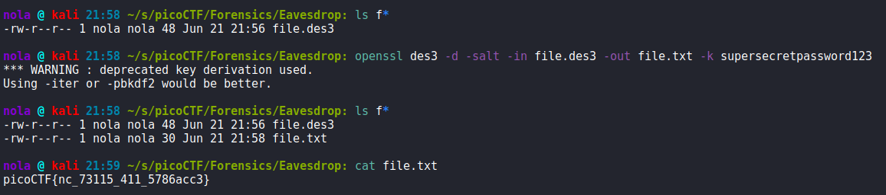
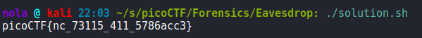

This time, we are provided with .pcap file that can be analyzed in Wireshark. It is a rather short capture as it only contains 75 packets. If we look at data section for TCP packets, we can find out that there are some unencrypted conversations captured. To see more, lets right-click 12th packet, then press 'Follow' and 'TCP Stream':

And we are presented with our first conversation:

We can now see the data that has been exchanged between those hosts including a command that will decrypt the file. Also our packets are filtered to display only those that belong to this TCP stream. Time to find the actual file that has to be decrypted. According to our first conversation, the file was sent to port 9002 - we can set that as a filter:

This is also part of TCP stream 2. Lets also apply another filter because packets we are looking for, have to contain some data:

Turns out there is only one packet that meets those requirements. If we open the conversation window again (or navigate to data section in packet details), we can copy that data as raw hexadecimal format.

We can put our hexadecimal string into CyberChef, choose 'from hex' option and then download the file.

Make sure to name it file.des3 so that it matches the provided command. Lets decrypt it:

With help of tshark tool that is command line version of Wireshark, we can automate the entire proces:

