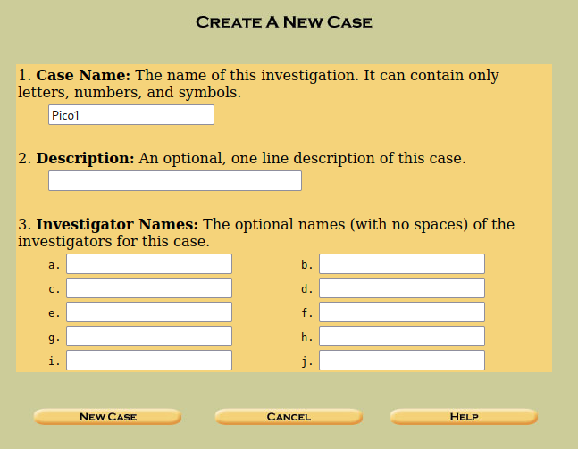
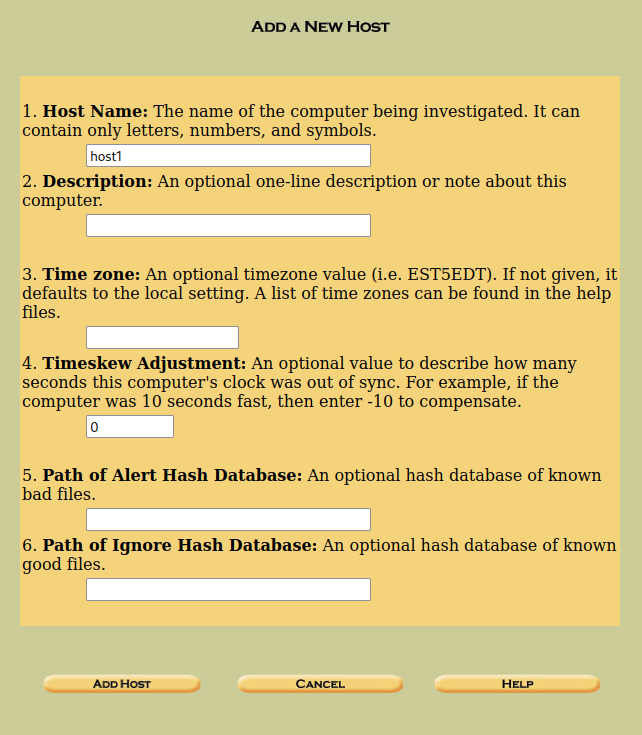
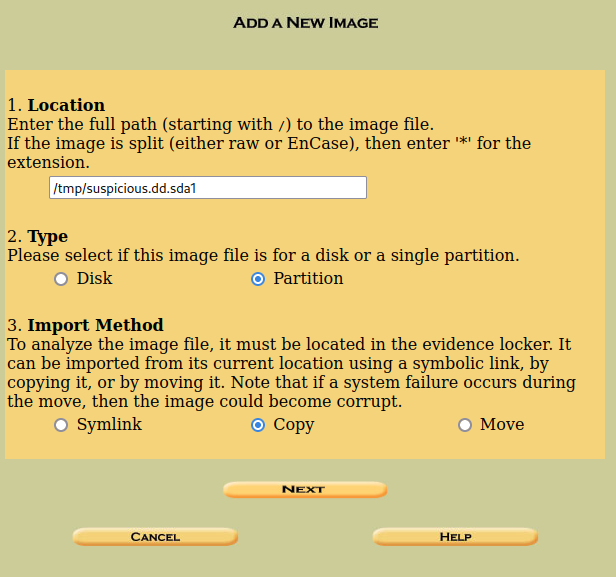
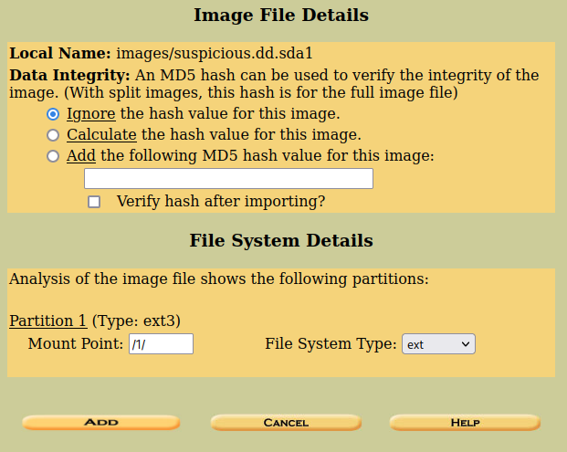
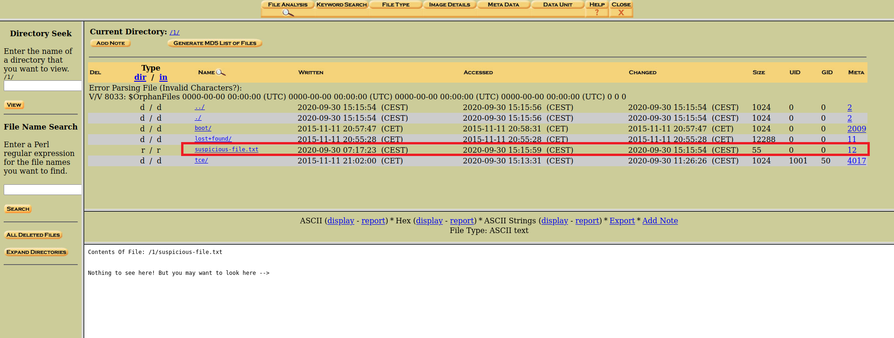
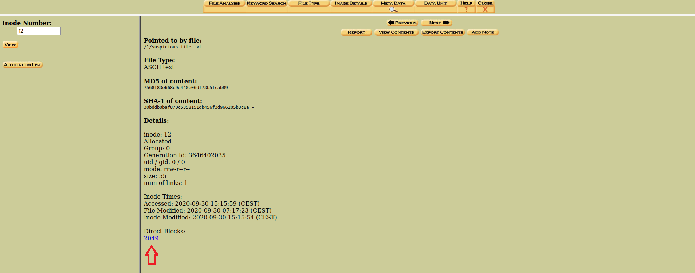
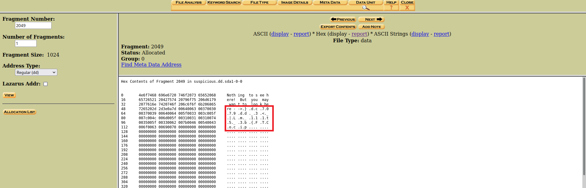

In this challenge, we are provided with disk image to analyze. Hint suggests that we can do it both without mounting that image and with image mounted. Decided to try analyzing it both ways. Firstly, without mounting the image, we can use 'strings' tool to check the contents. Getting satisfying results requires a little bit of tinkering however. After playing with different options for a while, I found out that specifying 16-bit little endian format seems to be the most elegant way:

We could technically also grep for pico, but we would need to know beforehand that the string is reversed. To retrieve the correctly formatted flag, we can use 'rev' tool:

If we want to solve the challenge by mounting the image however, there are some handy forensics tools that we can use as well. The most popular ones seem to be FTK Imager and Autopsy. Decided to try Autopsy as it was preinstalled in my Kali version. To invoke it, we can simply type 'sudo autopsy', open our browser and navigate to localhost at port 9999:

One thing is that, Autopsy prefers if we disable javascript for security reason. To do it in Firefox we can simply navigate to about:config and search for javascript.enabled, then change it to false (remember to enable it again after using Autopsy, otherwise most websites won't work):

Then we have to open a new case and provide a name for it:

And add a host - I've left everything as default:

Then we have to choose 'add image' and 'add image file'. Now is the important part. Firstly we have to provide absolute path to our image file, and then choose 'partition' instead of 'disk', since .sda1 extension indicates that we are dealing with a single partition. Also make sure that path is not too long or complicated, otherwise Autopsy might complain - I decided to move it to /tmp/ directory:

And now we can leave everything as default again:

Now if we click 'OK' and then 'Analyze', we can start out analysis. Firstly lets click on 'File analysis' at the top. We can see that there is the suspicious file. Viewing contents of that file we can see that there is an arrow pointing towards the end of file. 

If we read the second hint, we can suspect that flag might be hidden in allocated disk space for that file that is not being actively used, called 'slack space'. I we click on '12' in 'Meta' column, we are navigated to details for that inode:

Now if we click on '2049' in Direct Blocks section, we can check the content of that slack space and there is our flag:

