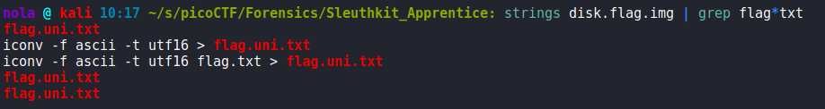

In this challenge, we have to analyze disk image. There are 2 ways we can approach it. Firstly we can use command line tools to search for a flag without loading the disk image. To list a few that are worth looking into - binwalk, exiftool, foremost, strings are tools that can come in handy for this challenge. After a while of playing with different options and formats using strings tool, I was able to actually find something:

Lets now try the second method, which is loading the disk image. If we navigate to Sleuthkit's website, looks like there is a tool that we can use, called Autopsy:

We can install it and then start it from terminal. To use it, we have to navigate to port 9999 on localhost:

Autopsy will probably complain about JavaScript being enabled. We can disable it in our browser settings - for example to disable it in Firefox, we can navigate to about:config, type 'javascript.enabled', toggle it off:

Reload the page and Autopsy won't complain about enabled JavaScript anymore (just remember to enable it after using Autopsy, otherwise websites won't work correctly). Now, we need to select 'new case':

We have to provide name for our case, everything else can be left as default:

Upon clicking 'new case', our case is created, then we have to add a host:

Everything can we left as default:

And now we have to add image:

Path to disk image has to be provided (I like to move it to /tmp directory and copy it instead of creating a symbolic link):

Now we can simply click add and leave everything as default:

And we can start analyzing by choosing /3/ partition and clicking 'analyze' button:

If we choose leftmost 'file analysis' option, we are presented with our directory tree. Here we can for example expand directories and look for something suspicious, like 'my_folder':

Or we can also use Perl regular expression to search for 'flag' (or 'flag.uni.txt' since we found that the file name using strings tool earlier):

Looking at the contents of the file, reveals our flag:

Another interesting thing is .bash_history file (or .ash_history?) in /3/root/:

Now everything is clear. Our flag has been converted from ascii to utf16 transformation format and that's the reason, the challenge was not as easy as using strings and grep to find 'pico' string. Also our original flag.txt file, instead of being simply removed using 'rm', has been deleted with 'shred' tool with -u and -z options. That's what man page says about this command:

When shred is used with -uz options, the file is not only removed but also deallocated and overwritten (3 times by default) and then all bytes are changed to zeros. That's the reason we can only find flag.uni.txt and not flag.txt. Now we can either copy our flag from flag.uni.txt file or we can export the file or open with a text editor:

After saving the file, it became available in /tmp/mozilla_nola0/ directory for me (nola is my username). There is our flag:

