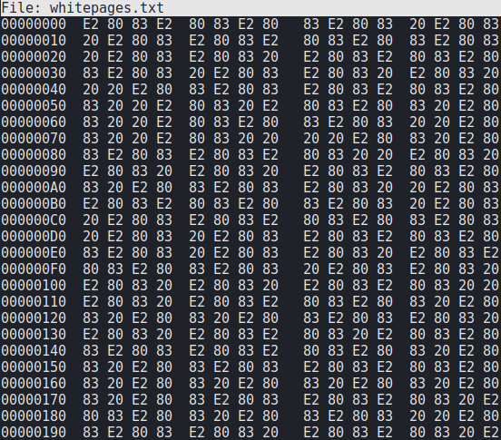
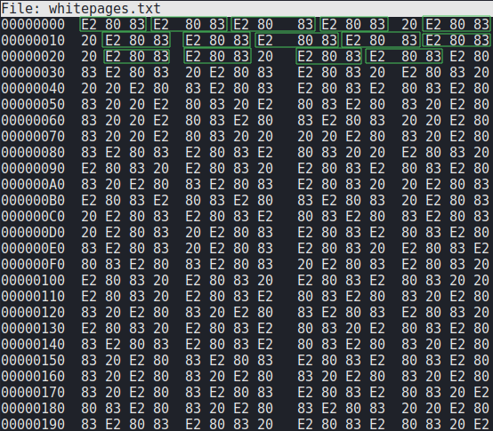
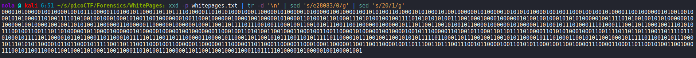
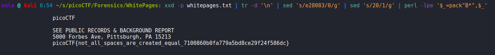
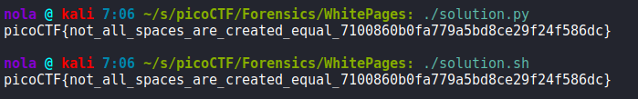

Hardest part about this challenge is figuring out how to start. We are provided with a file that contains only white spaces. Smart thing to do is looking at its contents in hexeditor:

Looks like the file contains only 4 types of hexadecimal byte representations: E2, 80, 83 and 20. If we look closely, we can see that E2 is always followed by 80 and that's followed by 83, while 20 appears randomly in no particular order:

20 in utf-8 = space, while E2 80 83 in utf-8 is a unicode character U+2003 that is also a space. In this case, we are dealing only with 2 different character types - E2 80 83 and 20. Clever thing to do would be trying to convert them to binary:

Then we can use short perl expression to convert from binary to text:

And there is out flag. In the end I decided to write 2 scripts, one using Python and the second using just shell tools:

