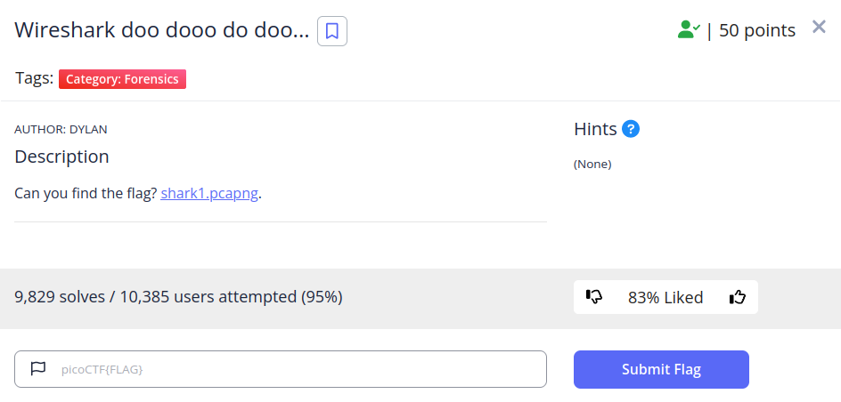

In this challenge, we are provided with .pcapng file that contains a record of captured packets that have been sent through the network over certain amount of time. Most popular software to analyze that type of files is Wireshark. If that software is installed we can invoke file directly by running 'Wireshark \<filename\>' in terminal or just opening Wireshark itself and then choosing pcap/pcapng file we want to analyze (Wireshark is extremely powerful tool and can do much more, e.g. the reverse, you can capture the packets in real time and analyze the traffic or export that capture to pcap/pcapng to analyze them further later). One thing I'm trying to do as much as I can while solving picoCTF challenges is using regular expressions to check for low-hanging fruits and this time it was the correct approach. After loading our .pcapng file, we can use Find Packet from the Edit menu. That way we can filter contents of every packet. Wireshark also provides users with an option to search through packets using Regular Expressions. To ensure that we don't skip the flag even if it was previously encrypted, the pattern I used was: [a-zA-Z0-9]{7}\{[a-zA-Z0-9_]{5,50}\}

And what do you know, we have a decent odds that we have just found the flag. Since it's encrypted, we can throw it into CyberChef and try checking for most common cyphers. Seems like this time it was just a simple ROT13 cypher. There is our flag:

Managed to automate that entire process by using a simple shell one-liner:

