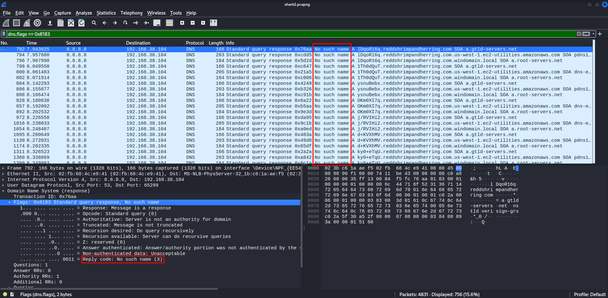

Time to analyze .pcapng file using Wireshark. Upon loading the file, it's always wise to check for a low hanging fruit by using filter checking for 'pico' string. And what do you know, we already found some results:

Bad news is that, it's 89 packets and every one of those packets contains a flag. Time to find out which is the real flag. To print our all the flags for further decrypting, we can use 'tshark -r shark2.pcapng -Y 'frame contains picoCTF' -e text -T fields | cut -d ',' -f 4 > results.txt':

But after enough time spent trying to decode these flags using CyberChef, and looking at available hints, I realized that might rather be a decoy. Lets go back to Wireshark and look for something suspicious. If we look at Statistics > Protocol Hierarchy, we can see that 31.3% of packets are DNS queries/responses:

But if we look at Statistics > Conversations, it turns out that there are only 6 conversations in total:

What are all those DNS queries then? Lets find out. So, we have 1512 DNS packets. If we look at responses, we can see that they all contain 'No such name' flag, meaning they do not return anything useful:

Lets look at queries then:

We can see that there is something weird going on with domain names we are asking about. They all start with 8 somewhat random characters instead of valid subdomains before .reddshrimpandherring.com. Also, if we look at conversations and limit them to DNS queries, we can see that despite the fact that majority goes to google (ip.dst==8.8.8.8), there are some DNS queries that go to a different DNS server:

Lets narrow our filter results down:

For each 8 character string in subdomain, there are 3 DNS queries with different paths. Let's filter that too:

And now we are left with what we need. Moreover, those double equal signs at the end are an indication that we might be dealing with base64 encoded string. Lets try decoding it with CyberChef:

And there we go, this is our flag. I have also used tshark to write a shell one liner to solve the challenge for us automatically:

