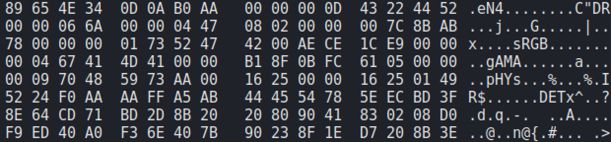
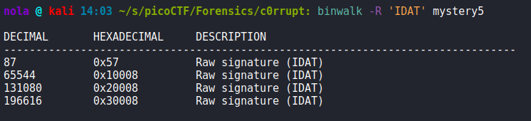

In this challenge we are presented with a file that has been corrupted in some way. Running 'file' command is not helpful as the output indicates that is just 'data'. Running 'strings' tool is more helpful as header strings we are able to discover are names of chunks from PNG header:

Opening 'mystery' file in hexeditor lets us inspect the header more thoroughly.

Looks like some knowledge about how PNG header works will be essential for this challenge. Decided to separate different parts with colors:

Firstly, PNG file always starts with its' unique 8-byte PNG signature (purple color). After those 8 bytes, PNG header is divided into chunks. Every chunk contains 3 or 4 fields, depending whether chunk contains chunk data field. In our case every chunk contains 4 fields so that makes it a bit easier. 

a) First field is Data Length (yellow color) and length of this field = 4 bytes. This field described how many bytes are stored by Chunk Data field of this chunk. 

b) Second field (green color) contains Chunk Type and it's also a 4 byte value. If we translate every byte of this field, we get the name of the chunk.

c) Third field is Chunk Data (orange color). Length of this chunk varies and is described by first field (Data Length). Third field can contain 0 bytes but that does not happen in this challenge.

d) Last field (red color) is CRC (Cyclic Redundancy Code). Based on Chunk Type and Chunk Data fields, we calculate a checksum, that can be used to verify integrity of our chunk to see if nothing is corrupted. It's also 4 bytes.

So let's start with looking into first 8-byte (PNG signature)

That means we have to fix byte #1 #3 #6 and #7:

Moving to the first chunk, first field of that chunk (yellow) suggests that Data Length = 0d - if we count length of Chunk Data field (orange), it is 13 so the field is correct. With second field - Chunk Type, there is clearly something wrong as we are unable to read what type it is. Wikipedia comes to save the day:

Seems like we have to switch first 2 bytes of that field: (43 22 44 52) -> (49 48 44 52). That lets 'file' tool to successfully classify our data as PNG file:

That fact means we can investigate the header further using pngcheck tool. It's a tool that checks png files for corruption:

CRC error indicates that something is wrong with one of the following chunks (pHYs). This chunk holds the pixel size. It's always 9 bytes in total. First 4 bytes tell us about amount of pixels in X-axis. Second 4 bytes hold the information about amount of pixels in Y-axis. Last byte is a Unit Specifier and can only hold 2 values (0 or 1). 0 means unit is known, while 1 means that unit is metre. If we look closely, first 4 bytes are AA 00 16 25. That would mean that image width = 2852132389 pixels. Slightly too wide it you ask me. Since 4 bytes that represent image height are 00 00 16 25, lets replace AA -> 00 for our width and see whether that fixes the issue. Lets run pngcheck again:

There is still something wrong with our header - one of Data Length field is too large. Let's list them out:

IHDR - 00 00 00 0d (13 bytes)

sRGB - 00 00 00 01 (1 byte)

gAMA - 00 00 00 04 (4 bytes)

pHYs - 00 00 00 09 (9 bytes)

IDAT - AA AA FF A5 (45813006245 bytes)

Means Chunk Data of IDAT is what we will look into, but firstly lets fix Chunk Type (AB 44 45 54) -> (49 44 41 54) (last green rectangle). As for Chunk Data, I have a suspicion that changing first two bytes from AA to 00, might be enough (similarly as we did with pixel width in pHYs chunk so lets confirm whether it's true or not. We can confirm it using 'binwalk' tool:

Output tells us that Chunk Type field for IDAT chunks start at offset 0x57, 0x10008, 0x20008 and 0x30008. Knowing that we can calculate Data Length. Prepared simple graphics to make it easier:

0x10008 - 0x57 - (0x4 * 3) = 0xFFA5

Turns out my predictions were accurate and changing first two bytes (AA AA -> 00 00) for IDAT Data Length is what we should do. Now file is fixed and can be opened with any image viewer to retrieve the flag. Decided also to automate the entire process and all that can be done by just running script.py and get the flag:

