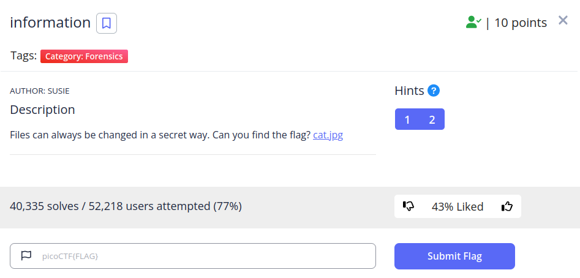
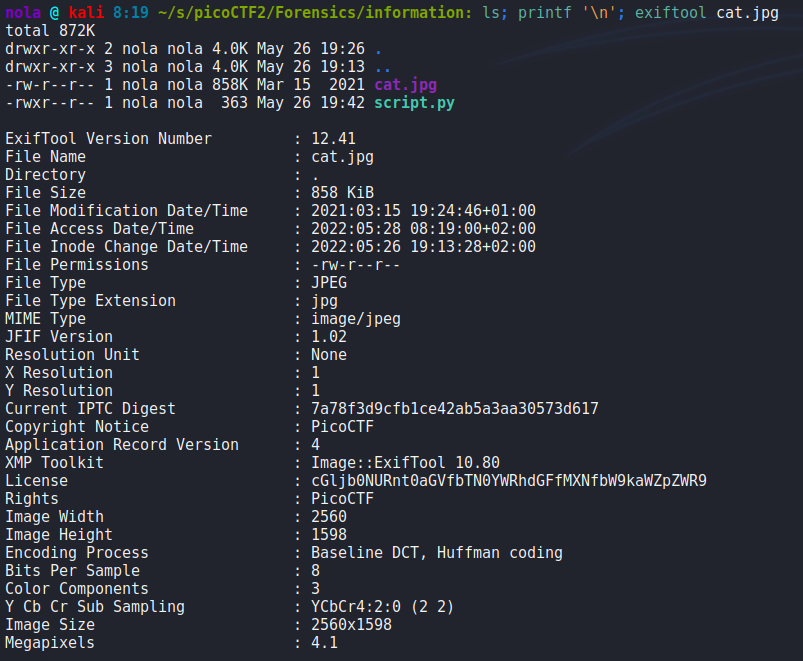
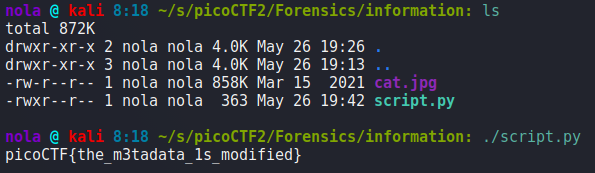

This challenge is about finding information in metadata of image. Whenever we are provided with an image, Exiftool is a tool I'm using right away, it will be really handy for this challenge overall and required if you want to use my script. Firstly we use it with just one argument - our file, to examine it's metadata.

License is suspicious so that's something we have to look into. Output of exiftool is firstly piped into Python variable using subprocess library, then it's formatted so that we get rid of everything we are not interested in, and we are left with just the string. Figuring out which algorithm to use for decoding is not too hard since it's of the first challenges therefore we don't expect to see the use of any advanced ciphers. Since string contains lowercase and uppercase letters, as well as digits and no other characters, Base64 should be our first guess, so we take Base64 Python standard library and decode it with additional 2 lines of code to recover our flag.

