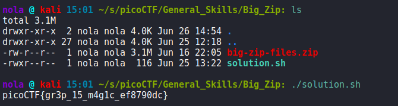

This is a freshly added challenge, so decided to give it a try. It's a pretty straight forward one. We are handed .zip file that contains a lot of .txt files and folders that contain more folders and more .txt files, sweet. Firstly we have to unzip the archive and then search recursively through directories using grep. After we manage to find the file, we make sure that output string is edited nicely. Two lines of Shell code will do all of that for us, quick & easy:

