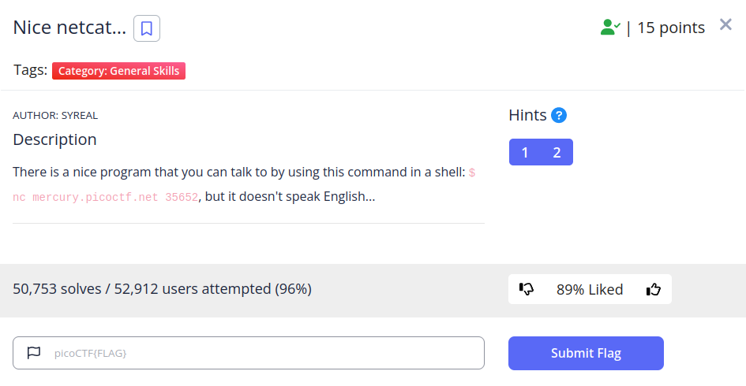
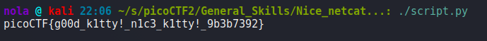

This challenge is a really simple one but for some reason formatting code in Python gives me so much joy that I wanted to upload it anyway. Netcat returns a decimal representation of flag characters line by line so everything we need to do is to convert numbers into characters and format it properly so we get the entire flag on one line. Python makes it a walk in the park.

