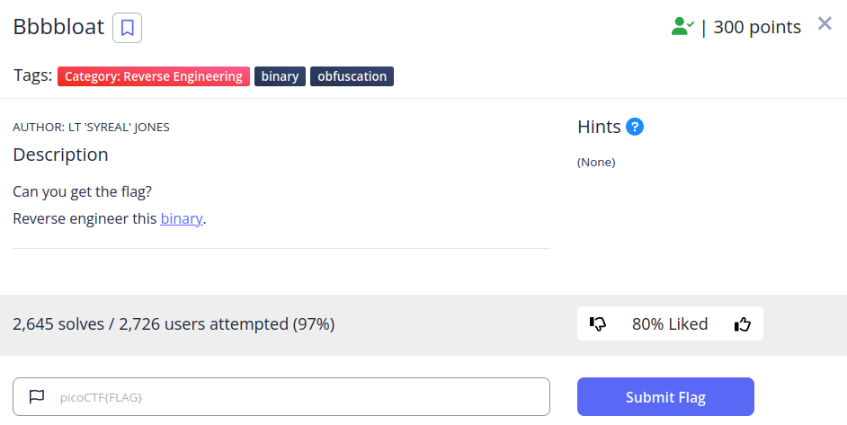
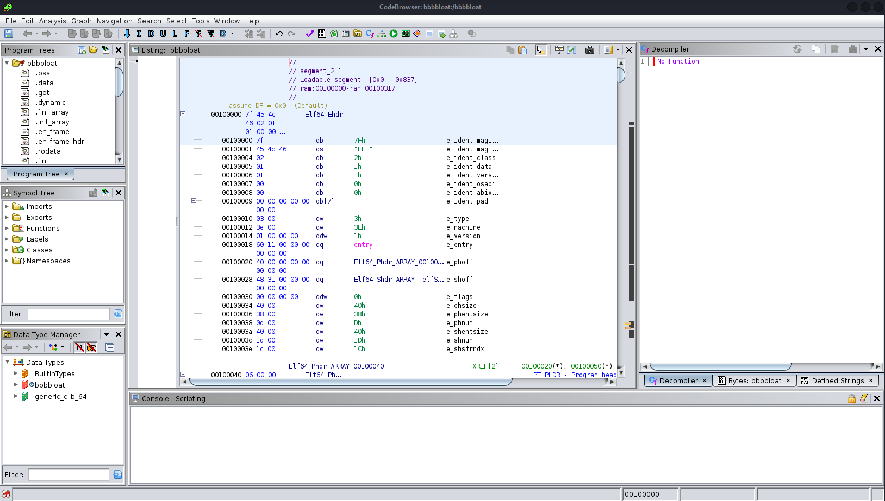
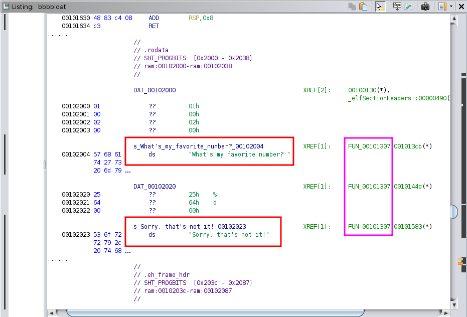
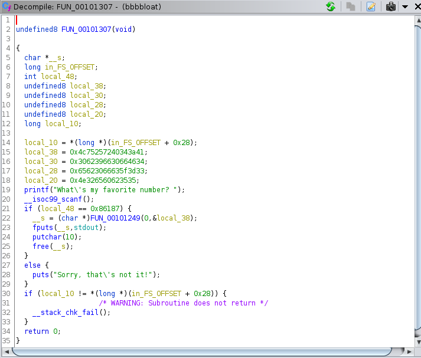
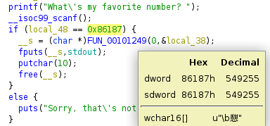
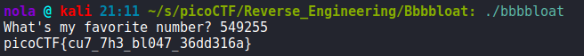
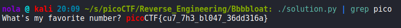

Time to analyze an executable file. There is a lot of command line based tools that can be used for that: file, strings, nm, ltrace, strace, hexeditor, hexdump, xxd, ldd, objdump, readelf, to name a few - but I was not able to extract anything of value using them in this case. Also used GDB but that didn't solve the issue, most likely because I'm not familiar enough with GNU Debugger. Running binary prints a simple question - 'What's my favorite number?' and after answering, we can see 'Sorry that's not it'. Decided to use something more complex. When reversing a binary, there are two platforms that I enjoy using. One of them is Ghidra, software reverse engineering tool created and developed by NSA that became open source. The second is Cutter, a part of Radare2 (framework designed to analyze binaries) with graphical user interface. Decided to go with Ghidra this time but steps for Cutter are similar and can be even easier to use for this task. To start working with it, we have to use ghidraRun executable, create a new project and import our binary. Then, we have to agree when asked about analyzing the binary. All analyzers that we might need, should be specified by default. Eventually, we are presented with this kind of window:

Technically we could just scroll our main window until we see the question about favorite number and the response (we could also use Window > Defined Strings feature).

Double-clicking the function name on the right should show contents of that function in decompile view pane:

If we look closely, local_48 variable is compared with 0x86187 hex value and if those values match, __s variable is printed to stdout based on return from FUN_00101249 function. If those values do not match, then 'Sorry that's not it' response is printed to stdout. If we hover our cursor over 0x86187, Ghidra shows that 549255 is the decimal representation of that hex value:

Now to check whether our assumption is correct, lets use execute the Bbbbloat binary again:

And there is our flag. Decided also to write a script that checks number up to 1 milion so that way we can brute-force this challenge - it takes a few minutes, it's not ideal solution obviously but that's something that can be considered capable of finding the flag:

