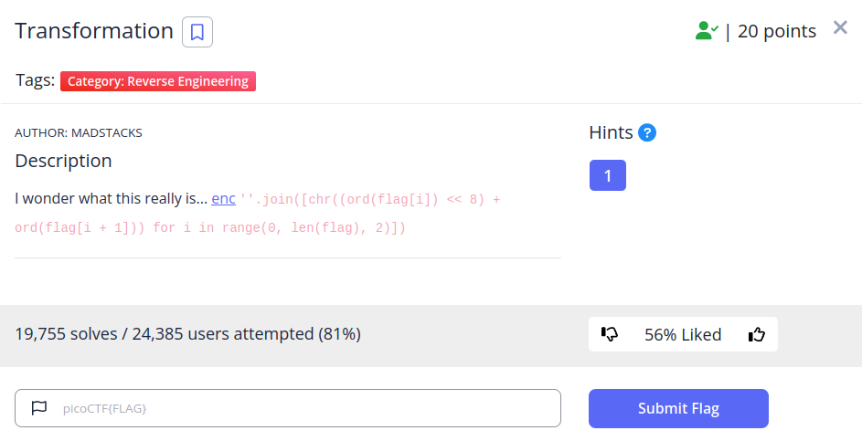
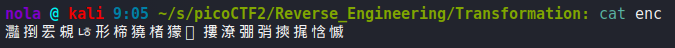
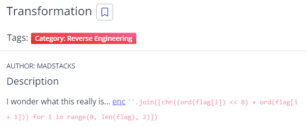
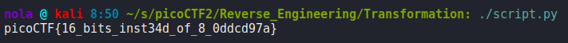

In this challenge, string in enc file has been encoded in some way and we have to figure out how it's been done so we can reverse it.

We are also provided with Python code that has been used to encode the string:

Analyzing the code, we can figure out that for every 2 characters, their hex representation has been taken and concatenated. That has been achieved by shifting value of the first character by 8 bits. After that, the value was translated back to text using UTF-16 transformation format. In this case, all we have to do is to convert text back to hex using that UTF-16 transformation format and split those values into 2 characters, then transform them to text using UTF-8:

