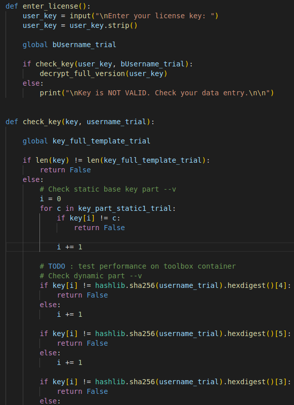

In order to solve this challenge, we have to analyze keygenme-trial.py script. This script starts with calling intro_trail() function (which is not important) and then since arcane_loop_trial variable is set to true, also calls menu_trail() function. This function lets us choose from 4 available options. In order to proceed towards finding a flag, we have to investiage enter_license() function called when users' choose option c). That function asks us for our key and then calls check_key() function to verify whether key we provided is correct:

check_key() uses key_full_template_trial variable with is a string made of 3 concatenated substrings:

We don't have to do anything about static parts, we are only interested in dynamic part as check_key() function verifies whether we hashed our username correctly using sha256 hashing algorythm before concatenating it with those static parts. Simple script I wrote, firstly makes sure that keygenme-trial.py is in the same directory and then reads all the variables we need from first lines of the file. Decided to make it that way instead of importing the file, because I didn't want it to execute right away (it lacks "if __name__=='__main__':" block), did not want to edit it and could not figure out how to do it in elegant way using importlib (standard import does not work well if file we are importing contains a hyphen). After reading variables, dynamic part (username) is hashed and its' hexdigest is used to form a string according to how it is laid out in keygenme-trial.py. Then all those substring are concatenated to form our flag:

